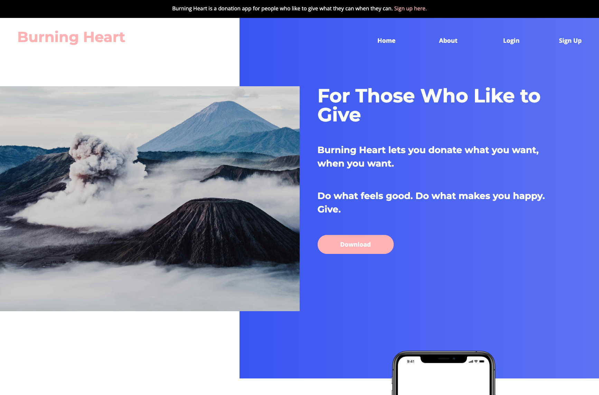

<h1 align="center"></h1>
<h4 align="center">A micro-donation mobile and web app for people who like to give what they can, when they can.</h4>
<br>



# WHAT IS BURNING HEART?

Too often in today's world, people desire to do the right thing but lack the time and resources necessary to feel like they're actually making a difference. It can be costly both in effort and money to feel like you have provided impact to those around you.

With `Burning Heart`, a micro-donation mobile application, the power to make quick, small donations to the charity of your choice is now in your hands. Written intentionally with both efficiency and simplicity of use in mind, users can instantly make a difference with small payments over time to not-for-profits around the world. Please enjoy this `Burning Heart`, and let yours give where it wants.

## TABLE OF CONTENTS

- [Getting Started](#getting-started)
- [Tech Stack](#tech-stack)
- [Server Documentation](#server-documentation)
  - [Schemas and Data Modeling](#schemas-and-data-modeling)
  - [Test Accounts](#test-accounts)
  - [Summary Table of API Endpoints](#summary-table-of-api-endpoints)
    - [Authentication Endpoints](#auth-endpoints)
    - [Accounts Endpoints](#accounts-endpoints)
    - [Charities Endpoints](#charities-endpoints)
    - [Donations Endpoints](#donations-endpoints)
    - [Data Endpoints](#data-endpoints)
- [Project Management](#project-management)
- [Marketing Plan](#marketing-plan)
- [Author](#author)
- [Acknowledgements](#acknowledgements)

## GETTING STARTED

(NOTE: `Burning Heart` is currently iOS-only. There are plans to create a web application, but you will need a Mac computer with XCode installed to turn the mobile `Burning Heart` client on.)

- Fork and clone (or just clone) this repository to your local machine
- Use the command `yarn` inside both the root directory and the client directories to install dependencies for the server and client, respectively
- Utilize the command `yarn server` inside the root directory to start up the Burning Heart back-end
- Make sure that Apple's XCode is installed, and then `cd` into the `client` directory and run the `react-native run-ios` command to start up the virtual iPhone environment
- Create a `.env` file in the root directory and make `PORT` and `JWT_SECRET` variables inside of it (e.g. `PORT = 8000`, `JWT_SECRET = Whatever you want.`)
- Open the debugging pane your local browser by going to the XCode Simulator and using `command + D` to open dev tools
- Enjoy!

## TECH STACK

### MOBILE CLIENT DEPENDENCIES

- `Production:`
  - [React](https://reactjs.org/)
  - [React Native](https://facebook.github.io/react-native/)
  - [React Router Native](https://reacttraining.com/react-router/native/guides/quick-start)
  - [React Hooks](https://reactjs.org/docs/hooks-intro.html)
  - [Context API](https://reactjs.org/docs/context.html)
  - [React Native TouchID](https://github.com/naoufal/react-native-touch-id)
  - [React Native SVG](https://github.com/react-native-community/react-native-svg)
  - [Axios](https://www.npmjs.com/package/axios)
  - [Victory](https://formidable.com/open-source/victory/docs/victory-line/)
  - [Tipsi-Stripe](https://tipsi.github.io/tipsi-stripe/)
- `Development`:
  - [Jest](https://jestjs.io/)
  - [React Test Renderer](https://reactjs.org/docs/test-renderer.html)

### WEB CLIENT DEPENDENCIES

- `Production:`
  - [React](https://reactjs.org/)
  - [React Router](https://reacttraining.com/react-router/)
  - [Redux](https://redux.js.org/)
  - [React Redux](https://react-redux.js.org/)
  - [Redux Logger](https://github.com/LogRocket/redux-logger)
  - [Redux Thunk](https://github.com/reduxjs/redux-thunk)
  - [React Router](https://github.com/ReactTraining/react-router)
  - [React Router DOM](https://www.npmjs.com/package/react-router-dom)
  - [React Stripe Elements](https://github.com/stripe/react-stripe-elements)
  - [Node Sass](https://www.npmjs.com/package/node-sass)
  - [NProgress](https://ricostacruz.com/nprogress/)
  - [Axios](https://www.npmjs.com/package/axios)
- `Development:`
  - [Jest](https://jestjs.io/)
  - [React Test Renderer](https://reactjs.org/docs/test-renderer.html)
  - [React Testing Library](https://github.com/kentcdodds/react-testing-library)

### SERVER AND DATABASE DEPENDENCIES

- `Production:`
  - [Express](https://expressjs.com/)
  - [Knex](https://knexjs.org/)
  - [Postgres](https://www.postgresql.org/)
  - [CORS](https://github.com/expressjs/cors)
  - [Helmet](https://helmetjs.github.io/)
  - [Morgan](https://www.npmjs.com/package/morgan)
  - [JSON Web Token](https://github.com/auth0/node-jsonwebtoken)
  - [Bcrypt.js](https://www.npmjs.com/package/bcryptjs)
  - [Stripe API](https://stripe.com/docs/api)
  - [Axios](https://www.npmjs.com/package/axios)
- `Development:`
  - [Jest](https://jestjs.io/)
  - [Nodemon](https://nodemon.io/)
  - [Supertest](https://www.npmjs.com/package/supertest)
  - [Cross-Env](https://github.com/kentcdodds/cross-env)

## SERVER DOCUMENTATION

### SCHEMAS AND DATA MODELING

Checkout this project's [DB Designer](https://www.dbdesigner.net/designer/schema/235466) modeling link for a visual representation of how this project's tables work.

`Accounts`

```
{
  "id": 2,                                  // Integer (primary key provided by server and autoincrements)
  "username": "admin",                      // String, required
  "password": "password",                   // String, required
  "firstName": "Nathan",                    // String, required
  "middleName": "Benjamin",                 // String, required
  "lastName": "Thomas",                     // String, required
  "email": "email@gmail.com"                // String, required
  "phone": "(708) 432-1234"                 // String, required
  "type": "user"                            // String, required
}
```

`Charities`

```
{
  "id": 3,                                  // Integer (primary key provided by server and autoincrements)
  "charityName": "Wounded Warriors",        // String, required
  "phone": 7078881298,                      // Integer, required
  "street1": "100 Street Way",              // String, required
  "street2": "P.O. Box 400",                // String
  "city": "San Francisco",                  // String, required
  "state": "CA",                            // String, required
  "zip": 94567                              // Integer, required
}
```

`Donations`

```
{
  "id": 1,                                  // Integer (primary key provided by server and autoincrements)
  "charityId": 4,                           // Integer, required (foreign key constraint to id column on charity table)
  "userId": 1,                              // Integer, required (foreign key constraint to id column on user table)
  "amount": 546                             // Integer, required
}
```

### TEST USER ACCOUNTS

`Accounts`

```
  username: "admin"
  password: "password"
```

```
  username: "nwthomas"
  password: "password"
```

### SUMMARY TABLE OF API ENDPOINTS

| Router    | Method | Endpoint                              | Description                                                                                                                                                                                          |
| --------- | ------ | ------------------------------------- | ---------------------------------------------------------------------------------------------------------------------------------------------------------------------------------------------------- |
| auth      | POST   | /api/auth/register                    | Creates a new `account` profile using the information sent inside the `body` of the request and returns a message along with the new `account` and a JSON Web Token in the `body` of the response.   |
| auth      | POST   | /api/auth/login                       | Uses the credentials sent inside the `body` to authenticate the account. On successful login, returns a message with the `account` profile and a JSON Web Token token in the `body` of the response. |
| accounts  | GET    | /api/restricted/accounts              | Retrieves an array of `account` objects and returns a message with the array in the `body` of the response.                                                                                          |
| accounts  | GET    | /api/restricted/accounts/:id          | Retrieves a single `account` object and returns a message with the object inside the `body` of the response.                                                                                         |
| accounts  | PUT    | /api/restricted/accounts/:id          | Updates an `account` in the database using the information sent inside the `body` of the request and returns a message with the updated `account` profile.                                           |
| accounts  | DELETE | /api/restricted/accounts/:id          | Removes an `account` from the database using the `id` sent in the URL parameters of the response.                                                                                                    |
| charities | GET    | /api/restricted/charities             | Retrieves an array of `charities` objects and returns a message with the array in the `body` of the response.                                                                                        |
| charities | GET    | /api/restricted/charities/:id         | Retrieves a single `account` object and returns a message with the object inside the `body` of the response.                                                                                         |
| charities | POST   | /api/restricted/charities             | Creates a new `charity` in the database using the information sent inside the `body` of the request and returns a message along with the new `charity` profile.                                      |
| charities | PUT    | /api/restricted/charities/:id         | Updates a `charity` in the database using the information send inside the `body` of the request and returns a message with the updated `charity` profile.                                            |
| charities | DELETE | /api/restricted/charities/:id         | Removes a `charity` from the database using the `id` sent in the URL parameters of the response.                                                                                                     |
| donations | GET    | /api/restricted/donations             | Retrieves an array of `donations` objects and returns a message with the object inside the `body` of the response.                                                                                   |
| donations | GET    | /api/restricted/donations/:id         | Retrieves a single `donation` object and returns a message with the object inside the `body` of the response.                                                                                        |
| donations | GET    | /api/restricted/donations/account/:id | Retrieves an array of `donations` objects for a specified `account` by `id` and returns a message with the array inside the `body` of the response.                                                  |
| donations | GET    | /api/restricted/donations/charity/:id | Retrieves an array of `donations` objects for a specified `charity` by `id` and returns a message with the array inside the `body` of the response.                                                  |
| donations | POST   | /api/restricted/donations             | Creates a new `donation` in the database using the information sent inside the `body` of the request and returns a message along with the new `charity` profile.                                     |
| donations | PUT    | /api/restricted/donations/:id         | Updates a `donation` in the database using the information sent inside the `body` of the request and returns a new message with the updated `donation`.                                              |
| donations | DELETE | /api/restricted/donations/:id         | Removes a `donation` form the database using the `id` sent in the URL parameters of the response.                                                                                                    |
| data      | GET    | /api/restricted/data/donations/:id    | Retrieves an array of `month` objects specifying the `x` and `y` properties for the `account` profile specified by the `id` in the request parameters and returns it in the response.                |

### AUTH ENDPOINTS

#### **Register** - _Registers an account_

_Method Url:_ `/api/auth/register`

_HTTP method:_ **[POST]**

#### Headers

| name           | type   | required | description              |
| -------------- | ------ | -------- | ------------------------ |
| `Content-Type` | String | Yes      | Must be application/json |

#### Body

| name        | type    | required | description    |
| ----------- | ------- | -------- | -------------- |
| `username`  | String  | Yes      | Must be unique |
| `password`  | String  | Yes      |                |
| `firstName` | String  | Yes      |                |
| `lastName`  | String  | Yes      |                |
| `lastName`  | String  | Yes      |                |
| `email`     | String  | Yes      | Must be unique |
| `phone`     | String  | Yes      |                |
| `type`      | String  | No       |                |
| `charityId` | Integer | No       |                |

_Example:_

```
{
  "username": "thedude",
  "password": "password",
  "firstName": "Nathan",
  "middleName": "Benjamin",
  "lastName": "Thomas",
  "email": "nate@gmail.com",
  "phone": "(908) 574-3592",
  "type": "user",
  "charityId": 1
}
```

#### Response

##### 200 (OK)

> If you successfully register an account, the endpoint will return an HTTP response with a status code `200` and a body as below.

```
{
  "error": false,
  "message": "Your account was created successfully.",
  "account": {
    "id": 1,
    "username": "thedude",
    "firstName": "Nathan",
    "middleName": "Benjamin",
    "lastName": "Thomas",
    "email": "nate@gmail.com",
    "phone": "(908) 574-3592",
    "type": "user",
    "charityId": 1,
    "created_at": "2019-04-24T21:20:15.034Z",
    "updated_at": "2019-04-24T21:20:15.034Z"
  }
}
```

##### 406 (Not Acceptable)

> If you are missing a username, password, first name, middle name, last name, or email, or phone for registration, the endpoint will return an HTTP response with a status code `406` and a body as below.

```
{
  "error": true,
  "account": {},
  "message": "Please include the required credentials and try again."
}
```

##### 409 (Conflict)

> If the submitted username or email is a duplicate of what is already in the database, the endpoint will return an HTTP response with a status code `40` and a body as below.

```
{
  "error": true,
  "usernameError": <true/false depending on if username is duplicate>,
  "emailError": <true/false depending on if email is duplicate",
  "message": "Sorry, that <username and/or email> already exists."
}
```

##### 404 (Bad Request)

> If you send in invalid fields, the endpoint will return an HTTP response with a status code `404` and a body as below.

```
{
  "error": true,
  "account": {},
  "message": "Your account could not be created."
}
```

##### 500 (Internal Server Error)

> If there is a server or database error, the endpoint will return an HTTP response with a status code `500` and a body as below.

```
{
  "error": true,
  "account": {},
  "message": "There was an error processing your request."
}
```

#### **Login** - _Logs in an account_

_Method Url:_ `/api/auth/login`

_HTTP method:_ **[POST]**

#### Headers

| name           | type   | required | description              |
| -------------- | ------ | -------- | ------------------------ |
| `Content-Type` | String | Yes      | Must be application/json |

#### Body

| name       | type   | required | description    |
| ---------- | ------ | -------- | -------------- |
| `username` | String | Yes      | Must be unique |
| `password` | String | Yes      |                |

_Example:_

```
{
  "username": "admin",
  "password": "password"
}
```

#### Response

##### 200 (OK)

> If you successfully register an account, the endpoint will return an HTTP response with a status code `200` and a body as below.

```
{
  "error": false,
  "message": "You were logged in successfully.",
  "account": {
    "id": 1,
    "username": "thedude",
    "firstName": "Nathan",
    "middleName": "Benjamin",
    "lastName": "Thomas",
    "email": "nate@gmail.com",
    "phone": "(908) 574-3592",
    "type": "user",
    "charityId": null,
    "created_at": "2019-04-24T21:20:15.034Z",
    "updated_at": "2019-04-24T21:20:15.034Z"
  },
  "token": "eyJhbGciOiJIUzI1NiIs4nR5cCI6IkpXVCJ9.eyJzdWJqZWN0ojoyLCJ1c2VybmFtZSI6ImFkbWluIiwiaWF0IjoxNTU2MTQ1MTE1LCJleHAiOjE1NTYyMzE1MTV9,vmwmkl7xJVoobsQ1QLSfTQenoFfy_QwGzZcgJ3p9sLI"
}
```

##### 404 (Not Found)

> If you send in a username or password that does not match one in the database or the passwords do not patch, the endpoint will return an HTTP response with a status code `404` and a body as below.

```
{
  "error": true,
  "message": "You could not be logged in."
  "account": {}
}
```

##### 500 (Bad Request)

> If you send in invalid fields, the endpoint will return an HTTP response with a status code `500` and a body as below.

```
{
  "error": true,
  "user": {},
  "message": "There was a problem with your request."
}
```

### ACCOUNTS ENDPOINTS

### CHARITIES ENDPOINTS

### DONATIONS ENDPOINTS

### DATA ENDPOINTS

## PROJECT MANAGEMENT

- You can view the [Trello Board](https://trello.com/b/YWsebwOT/burning-heart) for this project to review past checkpoints and current aspects of the project timeline

## MARKETING PLAN

- You can view the [marketing plan](https://docs.google.com/document/d/1mPc1YiQQKjE39tRgbLVfITX5Var6t_l52Sq-sgTXEfA/edit?usp=sharing) for Burning Heart. This plan includes target demographics, target market, message summary, call to action, and the project planned rollout for the marketing campaign.

## AUTHOR

- [Nathan Thomas](https://github.com/nwthomas)

## ACKNOWLEDGEMENTS

- Thanks to my family, close friends, and particularly my parents for always teaching me the value of giving back to others. I wouldn't have thought of this project idea if it weren't for you.
- Thanks to [Lambda School](https://lambdaschool.com/) for the phenomenal education I've received. You are the reason I can execute with code when I have an idea instead of stumbling around in the dark.

[](https://forthebadge.com) [](https://forthebadge.com) [](https://forthebadge.com)
